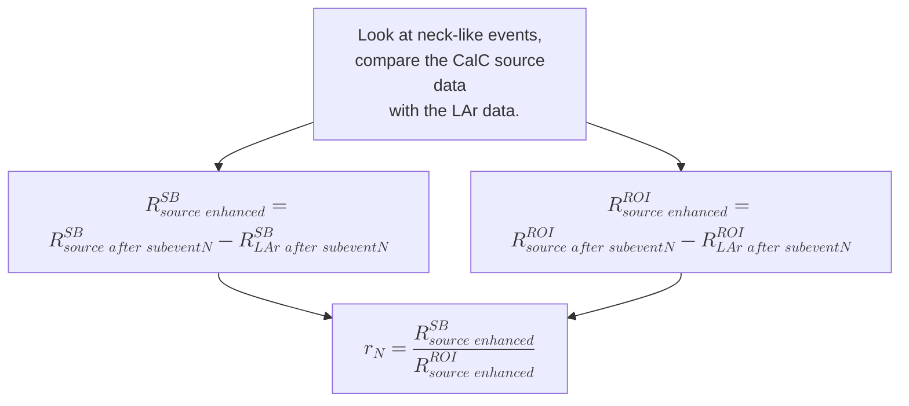
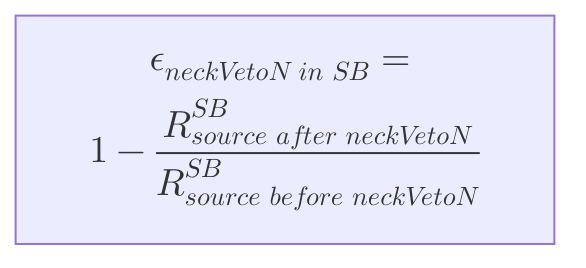
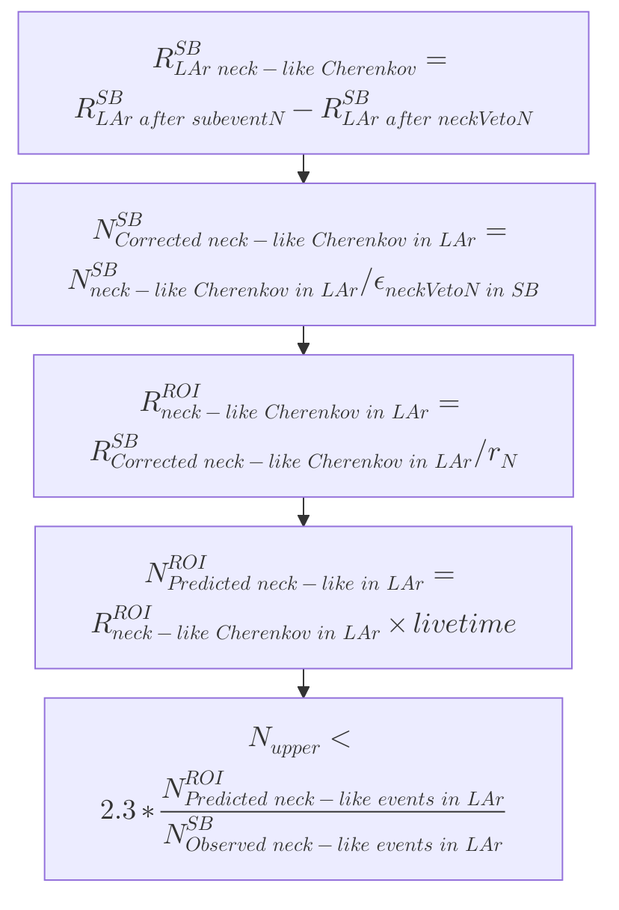
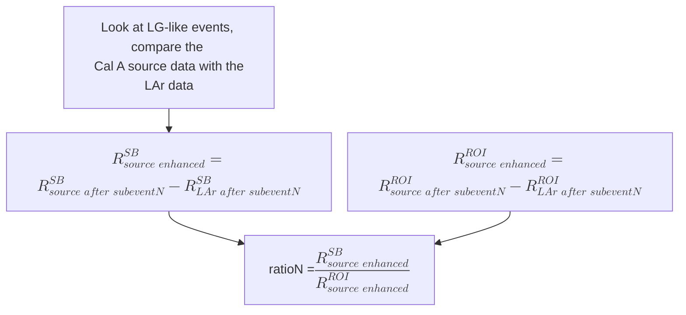
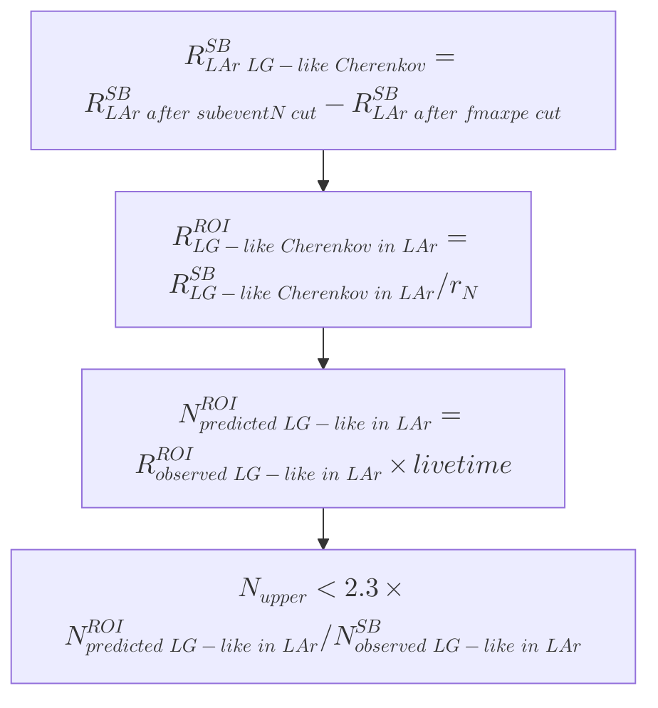

## Overview/Abstract

To estimate the Cherenkov backgrounds, we use a 388 live-day open dataset which has a total of 639 LAr physics runs in the 3-year WIMP search (November 2016 to March 2020), as well as 6 runs of SLB005 $^{232}$U source (4 runs with the source at Cal C/detector neck, and 2 runs with the source at Cal A/detector equator).

Following the methods in Rob Stainforth's Cherenkov STR (DEAP-STR-2018-022-RevB), we first apply Rob's analysis cut flows and ROI top20 (93$\leq$ nSCBayes $\leq$ 200) exactly to the new RAT v5.16.0 reprocessed data, and scale the results by the livetime of 246.64 live-day used by Rob. We call this procedure as sanity check. Detailed calculations and discussions are included in the sanity check section, for people to review the procedures.

The sanity check shows that by using the RAT v5.16.0 reprocessed dataset and following Rob's cuts exactly, our results are basically consistent with Rob's. The discrepancies mostly come from the extended LAr physics dataset, which has 388 live-days compared to the 246.64 live-days used by Rob. By using a smaller dataset, with the runs from run-18721 to 20959 (Physics Trigger November 2016 to October 2017), the discrepancies can be mitigated.

Then we switch to use the cut flows and ROI top10 (90$\leq$ nSCBayes $\leq$ 200) used by the PLR analysis, referring as the PLR analysis. Finally, we check the extended PLR ROI with the nSCBayes extended to nSCBayes = 500, referring as the extended PLR analysis. 

For both the PLR and extended PLR cases, all the LG-like events can be removed by the MBR<720 cut, while a few neck-like events remain after all the PLR cuts. If we consider them as neck-like Cherenkov events, we will get an upper limit larger than 1 event. On the other hand, with only about 1 live-day Cal A equator source run data, we suffer from large uncertainties when analyzing the LG-like events, and their estimations are around 0.

The main results are summarized below, and compared with Rob's STR results (Rob-STR). Note that these numbers are not the final numbers and are required to be cross-checked and reviewed.

The results are shown in the form of this equation:
$$N_{up}<N\mathrm{[predicted~in~LAr~ROI]}\times \mu_{up}/N\mathrm{[observed~in~LAr~SideBand]},$$
where $\mu_{up}$ is the one-sided upper limit, assuming that we observed $n$ events in the sideband after all the PLR cuts. 

Note that for the PLR paper, we mainly use the extended ROI. The other ROI cases are listed for comparison.

- **Updated Extended PLR (387.2 live-day)**
Total neck-like Cherenkov events observed in SB (387.2 day): 207008 $\pm$ 631
rate(ROI neck) =0.4564-0.2134 = 0.243 $\pm$ 0.00446542 mHz

Total neck-like Cherenkov events observed in ROI (387.2 day): 8130 $\pm$ 150

For the whole 387.2 live-day LAr data, after all the PLR cuts, we observe 72 events in the 

From the simulations/MC productions (RATv5.15.3), after all the PLR cuts, we expect 12 SB events and   ROI events are from the contribution from the dust $\alpha$, neck $\alpha$ particles and PMT neutrons.  

$u_{90\%}$=53.7825, $u_{68\%}$=47.8642
 ROI events predicted 13930 $\pm$ 3911


- **Extended PLR ROI**
There are 72 events in the ROI and 44 events in the SB, all of them are neck-like events. For observing  44 "neck-like Cherenkov" events in the SB, $\mu_{up}=53.783$ \[C.I. 90\% \], 
and $47.864$ \[C.I. 68\%\].

$N_{neck}< (15544 \pm 4217)\times 53.783/(207031 \pm 634) = 4.038 \pm 1.096$ \[C.I.90\%\] 
$N_{neck}< (15544 \pm 4217)\times 47.864/(207031 \pm 634)= 3.594 \pm 0.9750$ \[C.I.68\%\]
No LG-like events after the MBR<720 cut, so: 
$N_{LG}<(58361 \pm 72781)\times 2.3/(9864563 \pm 3142) = 0.0136 \pm 0.0170$ \[C.I.90\%\]
$N_{LG}<(58361 \pm 72781)\times 1.14/(9864563 \pm 3142)=0.00674 \pm 0.00841$ \[C.I. 68\%\]

$N_{total} < \sqrt{4.038^2+0.0136^2}=4.038$ \[C.I. 90\%\]; 
$N_{total} <\sqrt{3.594^2+0.00674^2} = 3.594$ \[C.I. 68\%\]


- Build and test the Cherenkov PDF


The following results are sanity checks with Rob's STR.
- **Rob-STR (246.64 live-day)** 
For n=1 (1 observed neck-like event after all cuts in 246.64 live-days), $\mu_{up}=3.89$ \[90\% C.I\], and $\mu_{up}=2.35$ \[ C.I. 68\%\], thus:
$N_{neck}<(1800 \pm 1632) \times 3.89/(63636 \pm 252) = 0.11$ \[C.I. 90%\];
$N_{neck}<(1800 \pm 1632) \times 2.34/(63636 \pm 252) =0.07$ \[C.I. 68%\]; (Rob used 2.34)
For n = 0 (0 observed LG-like events after all cuts in 246.64 live-days), $\mu_{up}=2.3$ \[90\% C.I\], and $\mu_{up}=1.14$ \[68\% C.I\]
$N_{LG} < (195756 \pm 100957) \times 2.3/4975559= 0.090$ \[C.I. 90\%\]; 
$N_{LG} < (195756 \pm 100957) \times 1.14/4975559 = 0.045$ \[C.I. 68\%\]
$N_{total} < \sqrt{0.11^2+0.09^2}=0.14$ \[C.I. 90%\]; 
$N_{total} <\sqrt{0.07^2+0.045^2} = 0.08$ \[C.I. 68%\].

- **Sanity check (v5.16.0 reprocessed 388-live-day dataset scaled to 246.64 live-day)**
$N_{neck} < (2002 \pm 1592 )\times 3.89/(87900 \pm 458) = 0.0886$ \[C.I. 90%\]; 
$N_{neck} < (2002 \pm 1592)\times 2.35/(87900 \pm 458) =0.0535$ \[C.I. 68%\]
$N_{LG} < (51472 \pm 39998)\times 2.3/(5198703 \pm 1818)=0.0228$ \[C.I. 90%\]; 
$N_{LG} < (51472 \pm 39998)\times 1.14/(5198703 \pm 1818)=0.0113$ \[C.I. 68%\]
$N_{total} < \sqrt{0.0886^2+0.0228^2} = 0.0915$ \[C.I. 90%\]; 
$N_{total} < \sqrt{0.0535^2+0.0113^2}=0.0547$ \[C.I. 68%\]

- **PLR (387.2 live-day)**  
There are 24 events in the ROI and 13 events in the SB, and all of them are neck-like events. For observing 13 "neck-like Cherenkov" events in the SB, $\mu_{up}=18.958$ \[C.I.90\%\], and $\mu_{up}=15.467$ \[C.I.68\% \]
$N_{neck}<1.079 \pm 0.2930$ \[C.I.90%\] 
$N_{neck}<0.8807\pm 0.2714$ \[C.I.68%\]

$N_{neck}< (8685 \pm 2357)\times 18.958/(152536 \pm 541) = 1.079 \pm 0.2930$ \[C.I.90\%\] 
$N_{neck}< (8685 \pm 2357)\times 15.467/(152536 \pm 541)= 0.8807 \pm 0.2390$ \[C.I.68\%\]

We have 0 observed LG-like events after the MBR<720 cut, so:
$N_{LG}<(33873 \pm 70258)\times 2.3/(9474473 \pm 3078)=0.00823 \pm 0.0171$ \[C.I. 90%\] 
$N_{LG}<(33873 \pm 70258)\times 1.14/(9474473 \pm 3078)=0.00407 \pm 0.00845$ \[C.I.68%\]

$N_{total} < \sqrt{1.079^2+0.00823^2}= 1.079$ \[C.I. 90\%\]; 
$N_{total} <\sqrt{0.8807^2+0.00407^2} = 0.8807$ \[C.I. 68\%\]

## 1. Datasets used for the analysis

For the Cherenkov estimation, we need two categories of datasets: the LAr physics runs and the LAr $^{232}$U source runs.

For the LAr physics runs, the following 4 run lists are used as LAr physics runs, reprocessed by the RAT v5.16.0 highE skim.
- PhysicsTrigger_November2016ToDecember2017_L2
- PhysicsTrigger_OpenData2018_L2
- PhysicsTrigger_OpenData2019_L2
-  PhysicsTrigger_OpenData2020_L2
By merging all the runs from these 4 run lists, we have:
- Number of runs: 739 
- Run range: 18721 to 27583
- Time range: November 2016 to March 2020
- Whole run time (without deadtime corrections): 414.76 days.
- Livetime (RAT v5.14.0 livetimecalc, used for sanity checks)
    with dead-time correction: 33558177.595 seconds or 388.4048 live-days
    with muon-veto correction: 33504416.298 seconds or 387.7826 live-days
- Livetime (RAT v5.16.0 livetimecalc updated by Matthew Dunford in early 2024, used for the PLR analysis)
    with dead-time correction (Trigger): 33581626.96 seconds or 388.6762 live-days
    with muon-veto correction (Trigger with MV): 33454230.82 seconds or 387.2017 live-days
    we use the Trigger with MV value for the PLR analysis.

For the $^{232}$U source runs, the following 4 run lists are reprocessed by RAT v5.16.0 highE skim:
- 2017MarThSource
SLB005: 19523 (CalC),19524 (CalC),19527 (CalC),19529 (CalA); SLB007: 19430, 19432, 19433, 19434
- ThSource_July2018_L0
SLB007: 23389, 23395, 23396, 23400, 23402
- ThSource_March2018_L0
SLB005: 22382(CalC), 22387(CalC), 22389 (CalA), 22394 (CalA)
- ThSource_May2018_L0
SLB007: 22843, 22847

The highE skim cuts are:
```
highE = (highFp_qPE || highFp_nSC || qPE>8000 || nSCBayes>7000)
highFp_qPE = (qPE>60 && fprompt>0.55)
highFp_nSC = (nSCBayes>50 && rprompt60Bayes > 0.55)
```

The source runs are tagged as either the SLB007 for an activity of 740.74 kBq, or the SLB005 with 18.52 kBq. Since the SLB007 is too intense to be used for analysis, only the SLB005 LAr $^{232}$U runs can be used for the Cherenkov analysis. Also, some runs in the lists are too short or have some issues to be used (see [Appendix A](#appendix-a-description-of-the-datasets)), and several runs are missing. 

Considering for these issues, only 6 runs are used here:

Cal C (source at the neck): 19523, 19524, 19527, 22382, 22387
Cal A (source at the detector equator):  19529, 22389, 22394

Note that the run 22394 has not been processed by the RAT v5.16.0 yet, here we use the v5.14.0 processed ntpule file. 

Cal C neck runs
- 19523
	v5.14.0 livetimecalc
	 with dead-time correction: 69593.7 sec,
	 with muon-veto correction: 69482.2 sec,
	v5.16.0 livetimecalc 
	with dead-time correction(Trigger): 69654.9 sec, 
	with muon-veto correction (Trigger with MV): 69298.2 sec,
- 19524
	v5.14.0 livetimecalc
	with dead-time correction:  80117 sec,
	with muon-veto correction: 79988.6 sec,
	v5.16.0  livetimecalc
	Trigger: 80187.3 sec,
	Trigger with MV: 79778.6 sec,
- 19527  
	v5.14.0 livetimecalc
	with dead-time correction:  85341.2 sec, 
	with muon-veto correction: 85204.5 sec, 
	v5.16.0 livetimecalc
	Trigger:  85416.3 sec,
	Trigger with MV: 84978.9 sec,
- 22387
	v5.14.0 livetimecalc
	with dead-time correction:  74022.2 sec,
	with muon-veto correction: 73903.6 sec,
	v5.16.0 livetimecalc (updated)
	Trigger:  74063.5 sec,
	Trigger with MV: 73872.4 sec,
- 22382 (updated)
    v5.14.0 livetimecalc
    with dead-time correction:  4548.02 sec,
    with muon-veto correction:  4540.74 sec,
    v5.16.0 livetimecalc
	Trigger: 4550.57 sec,
	Trigger with MV: 4538.7 sec,

Cal A equator runs
- 19529
	v5.14.0 livetimecalc
	with dead-time correction:  13249.2 sec,
	with muon-veto correction: 13227.9 sec,
	v5.16.0 livetimecalc
	Trigger: 13260.8 sec,
	Trigger with MV: 13192.5 sec,
- 22394
	v5.14.0 livetimecalc
	with dead-time correction:  74626.3 sec,
	with muon-veto correction: 74506.8 sec,
	v5.16.0 livetimecalc (updated)
    Triggers: 74668.1 seconds
    Triggers with MV: 74474.6 seconds
- 22389
    v5.14.0 livetimecalc
    with dead-time correction:  3928.74 sec,
	with muon-veto correction: 3922.45 sec, 
    v5.16.0 livetimecalc
    Triggers: 3930.95 seconds
    Triggers with MV: 3920.6 seconds 

Cal C total livetime (5 runs merged):  19523, 19524, 19527, 22387, 22382
updated reprocessing with v5.16.0: 312466.8 sec or 3.6165 live-days
//v5.14.0 dead-time correction:  309074.1 sec or 3.577 live-days (4 runs)
//old v5.16.0 Trigger with MV: 307928.4 sec or 3.564 live-days (4 runs)

Cal A total livetime (3 runs merged): 19529, 22389, 22394 
updated reprocessing with v5.16.0:  91587.7 sec or 1.06 live-days
// v5.14.0 dead-time correction: 87875.5 sec or 1.017 live-days (2 runs)
//old v5.16.0 Trigger with MV:  87667.3 sec or 1.015 live-days (2 runs)

For Cal C + Cal A for a total 8 runs: 4.68 live-days
As already pointed out by Rob, our analysis is limited by the low statistics of the  LAr $^{232}$U source data, which will cause large uncertainties. The 83 live-day vacuum $^{232}$U source dataset may help, but that dataset is limited by different optics and geometry. A section of the vacuum run analysis is listed at the end in this document.

For more detailed descriptions of these datasets, please see [Appendix A](#appendix-a-description-of-the-datasets) .     
For livetime comparisons, see Appendix B.
## Sanity checks with Rob's results

We first go through Rob's methods described in the Cherenkov STR (DEAP-STR-2018-022-RevB). In this section, the ROI, sideband and cut flow are used exactly same to Rob used, **NOT** from the PLR analysis. 

Here the **sideband** (SB) refers to the upper sideband of the ROI, i.e., keeping the same range of nSCBayes of the ROI, but the rprompt60Bayes values are extended from the ROI upper curve all the way to 1.0.

See the figure below for comparing the difference in the ROI and sideband. 
Rob: top25 && 93<= nSCBayes<= 200
PLR: top10 && 90<= nSCBayes<= 200
![[Pasted image 20241009160242.png]]
**Figure 1** Compare Rob's WIMP sideband and the ROI with the ones used by the PLR and extended PLR analysis.

See the table below for comparing the difference in the cut flow.

Table 1. Compare Rob's WIMP analysis cut flow with the PLR WIMP cut flow.
![[Pasted image 20241009160618.png]]

However, there are still two different factors compared to Rob's analysis:
1. The RAT version
   Rob: v5.9.4
   This study: v5.14.0 for a single  $^{232}$U source run 22394, and v5.16.0 for all other
2. LAr dataset
   Rob: 246.64 live-day data
   This study: 388 live-day data, and then scaled to 246.64 live-day
  
The RAT version 5.16.0 used here has some fixes on the baseline and smartCal, which can return more precise `rprompt60Bayes` and `nSCBayes` values, and also saves some higher PMT charges (mainly caused by high energy events like muon) while the older version of RAT can skip these values. This is the main factor which causes the difference.
## Analysis

In this section, we follow Rob's analysis step by step and compare his results by each steps.
Note that here Rob's ROI, SB as well as the cut flow are used, not the PLR ones. 

First, we **ONLY** look at the events in ROI and SB. The highE ntp files from the RAT v5.16.0 reprocess are skimmed by only keeping the events in the ROI and SB, but without any other cuts. The events are divided into the neck-like events and LG-like events by a `NHit/nSCBayes vs. nSCBayes` cut, as shown below:

Neck-like events： $\mathrm{NHit/nSCBayes > (-1.132E-3*nSCBayes) + 0.471692}$
LG-like events： $\mathrm{NHit/nSCBayes < (-1.132E-3*nSCBayes) + 0.471692}$

This separation is taken from the Cherenkov STR and was originally determined by eye, which still works well for the RAT v5.16.0 reprocessed data. The following figures compare this separation. Note that for the ROI events (Figure 4 and Figure 5), there are further separation in the neck-like events, by $\mathrm{NHit/nSCBayes > (-1.132E-3*nSCBayes) + 0.75}$ (green line in Rob's plot and dashed red line in our plot). We currently don't use this information, but just consider all the neck-like events.
![[Pasted image 20241014104004.png]]
**Figure 2** Rob's NHit/PE vs. PE plot of the Cherenkov **sideband** after the `subeventN==1` cut, for the entire physics runs (246.64 live-days).  It is the figure 2 in Rob's Cherenkov STR.

![[Pasted image 20241014121914.png]]
**Figure 3** For the RATv5.16.0 reprocessed data, the same NHit/PE vs. PE plot of the Cherenkov **sideband** after the `subeventN==1` cut, for the 388 live-day physics data.
![[Pasted image 20241014122425.png]]
**Figure 4** Rob's NHit/PE vs. PE plot of the Cherenkov **ROI** after the `subeventN==1` cut, for the entire physics runs (246.64 live-days).  It is the figure 2 in Rob's Cherenkov STR.

![[Pasted image 20241014122242.png]]
**Figure 5** For the RATv5.16.0 reprocessed data, the same NHit/PE vs. PE plot of the Cherenkov **ROI** after the `subeventN==1` cut, for the 388 live-day physics data.

To calculate the uncertainties, we assume the uncertainty from the livetime is negligible (i.e., 0).  
The following quadratic equations are mainly used for the uncertainty propagation:
$z = x\pm y$, $\delta z = \sqrt{\delta x^2 +\delta y^2}$
$z = x\cdot y, \delta z = z\sqrt{(\delta x/x)^2+(\delta y/y)^2 }$
$z = x/y, \delta z = |z|\sqrt{(\delta x/x)^2+(\delta y/y)^2 }$
$z = (x-y)/(u-v), \delta z= |z|\sqrt{\frac{\delta x^2+\delta y^2}{(x-y)^2}+\frac{\delta u^2 + \delta v^2}{(u-v)^2}}$
$z=const/x, \delta z = const/x^2\cdot\delta x$
### Neck-like events

#### An overview of the calculations

All the steps described below can be summarized into two equations:
$$N^{ROI}_\mathrm{predicted~in~LAr}= \frac{rate^{SB}_\mathrm{LAr~ Cherenkov ~(neckVetoN)}/\epsilon_\mathrm{neckVetoN}}{r_N=(rate_\mathrm{source~enhanced}^{SB}/rate^{ROI}_\mathrm{source~enhanced})}\cdot Livetime$$
$$N^{ROI}_\mathrm{observed~in~LAr} = rate^{ROI}_\mathrm{LAr~Cherenkov~(neckVetoN)}\cdot Livetime$$

where:
$rate^{SB}_\mathrm{LAr~Cherenkov ~(neckVetoN)} =rate^{SB}_\mathrm{LAr~after~subeventN~cut} - rate^{SB}_\mathrm{LAr~after~neckVetoN~cut}$

$rate^{ROI}_\mathrm{LAr~Cherenkov ~(neckVetoN)} =rate^{ROI}_\mathrm{LAr~after~subeventN~cut} - rate^{ROI}_\mathrm{LAr~after~neckVetoN~cut}$


$\epsilon_\mathrm{neckVetoN} = 1 - rate^{SB}_\mathrm{source~after~neckVetoN cut}/rate^{SB}_\mathrm{source~before~neckVetoN~cut}$

$rate_\mathrm{source~enhanced}^{SB} = rate^{SB}_\mathrm{source~after~subeventN} - rate^{SB}_\mathrm{LAr~after~subeventN~cut}$

$rate^{ROI}_\mathrm{source~enhanced} = rate^{ROI}_\mathrm{source~after~subeventN} - rate^{ROI}_\mathrm{LAr~rate~after~subeventN}$

and $r_N \equiv rate_\mathrm{source~enhanced}^{SB}/rate^{ROI}_\mathrm{source~enhanced}$.

After we obtain the number of Cherenkov events predicted and observed in ROI for the LAr runs of a certain livetime, we assume that these events can be removed after applying all levels of cuts. Then we estimate the upper limits if there could still be 1 event observed in the sideband at a specific confident level. 

To estimate such upper limits, consider a Poisson distribution with the mean value $\mu$,  for observing $n=1$ in the sideband at 90% C.L. , $\mu_{up}=3.89$.
where: 
$\mu_{lo} = \frac{1}{2}F^{-1}_{\chi^2} (\alpha_{lo};2n)$,
$\mu_{up} = \frac{1}{2}F^{-1}_{\chi^2} (1-\alpha_{up};2(n+1))$ and $n=0$.

Thus $N^{ROI}_\mathrm{observed~in~LAr}<3.89/N^{SB}_\mathrm{observed~in~LAr}\cdot N^{ROI}_\mathrm{predicted~in~LAr}$.
Here we can also define a sideband leakage fraction (LF) by $LF \equiv \mu_{up}/N^{ROI}_\mathrm{observed~in~LAr}.$

The following flowcharts show the detailed steps:







There are attached codes in the AnalysisNote to go through these steps. The corresponding rates should be provided in the code. 

For the neck-like events,  we further separate the events into the sideband and the ROI. The following table shows the event rates after Rob's cut flow, for the LAr physics run 18831, the Cal C $^{232}$U source run 19523 and the Cal A source run 22394 and 19529.

Table 2. Neck-like SB and ROI event rates after Rob's levels of cuts, for the LAr physics run 18831, Cal C neck run 19523, Cal A equator runs 22394 and 19529.
![[Pasted image 20241014172513.png]]

The rates after the `subeventN==1` cuts are listed below. The values are separated by the SB and ROI. The rates are compared for the LAr physics run 18831, source Cal C (neck) run 19523, and source Cal A (equator) run 22394 runs, respectively; and Rob's values are listed beside:

Run 18831 SB after subeventN cut = 3.0517 $\pm$ 0.1717 mHz  (Rob = 3.08 $\pm$ 017)
**Run 19523 SB after subeventN cut = 6.6816 $\pm$ 0.3099 mHz (Rob = 6.68 $\pm$ 0.31 )**
Run 22394 SB after subeventN cut =  3.2160 $\pm$ 0.2076 mHz (Rob =3.22 $\pm$ 0.10 )

Run 18831 ROI after subeventN cut = 0.2607 $\pm$ 0.0502  mHz (Rob =0.24 $\pm$ 0.05  )
**Run 19523 ROI after subeventN cut = 0.3736 $\pm$ 0.0733 mHz (Rob =0.34 $\pm$ 0.07 )**
Run 22394 ROI after subeventN cut = 0.2546  $\pm$ 0.0584  mHz (Rob = 0.25 $\pm$ 0.06)

From the values above, Rob pointed out that after applying the `subeventN==1` cut, there is a clear enhancement of events in the Cal C source run 19523 (at neck) over the standard physics run 18831 and the Cal A source run 22394 (at equator), in both the SB and ROI. Then after the `neckVetoN==0` cut, the rates of the Cal C source are consistent with the physics runs again. So we consider the Cal C $^{232}$U source events after the subeventN - events after the neckVetoN cut are the neck-like Cherenkov events introduced by the source:

$N^{CalC~source}_\mathrm{neck-like~Cherenkov~event} = N^{CalC~source}_\mathrm{neck-like~event~after~subeventN} -N^{CalC~source}_\mathrm{neck-like~event~after~neckVetoN}$

Then we convert the number of events to the rates. The rate is calculated with its uncertainty by:
$$\mathrm{rate} = N_{event}/\mathrm{livetime[sec]}\times 1000~\mathrm{[mHz]}$$
$$
\delta~\mathrm{rate} = \sqrt{N_\mathrm{event}}/\mathrm{livetime [sec]} \times 1000 ~~\mathrm{[mHz]}$$
In the following, we use the rates instead of the number of events, and the results can be easily resumed by multiplying the livetime.

The enhanced rates and their uncertainties are calculated by:

$\mathrm{rate[enhanced~event~after~subeventN]} = \mathrm{rate^{CalC~source}_{neck-like~event~after~subeventN}} -\mathrm{rate^{LAr}_{neck-like~event~after~subeventN}}$
$$=\delta \mathrm{rate[enhanced~event~after~subeventN]} = $$
$$\sqrt{(\mathrm{\delta rate^{CalC~source}_{neck-like~event~after~subeventN}})^2+(\delta \mathrm{rate^{LAr}_{neck-like~event~after~subeventN}})^2}$$
Here the CalC source run is run-19523, and the LAr run is run-18831.

After the subeventN cut, 

SB, Enhanced neck-like Cherenkov = 3.6299 $\pm$ 0.3543 mHz; (Rob = 3.60 $\pm$ 0.35 mHz). 
ROI, Enhanced neck-like Cherenkov = 0.1129 ± 0.0888 mHz (Rob= 0.10 $\pm$ 0.09 mHz) ; 

The ratio of sideband rate to the ROI rate, $r_N$ is then calculated by:

$$r_N = {\frac{\mathrm{rate[SB~enhanced]}}{\mathrm{rate[ROI~enhanced]}} }$$
and its uncertainty is: 
$$\delta~r_N = r_N \sqrt{ (\frac{\delta~\mathrm{rate[SB~enhanced]}}{\mathrm{rate[SB~enhanced]}})^2+(\frac{\delta~\mathrm{rate[ROI~enhanced]}}{\mathrm{rate[ROI~enhanced]}})^2 }$$

Thus, $r_N = 3.6299/0.1129 \pm (3.6299/0.1129\cdot\sqrt{(0.3543/3.6299)^2+(0.0888/0.1129)^2})= 32.1515 \pm 25.4942$ (Rob = $36.0\pm 32.6$).

The efficiency of the `neckVetoN` cut of removing neck-like Cherenkov is:
$$\epsilon_\mathrm{neckVetoN}=1 - \frac{\mathrm{rate[^{232}U~CalC~SB, after~neckVetoN]}}{\mathrm{rate[^{232}U~CalC~SB, before~neckVetoN]}}$$

⚠️**WARNING:** Here Rob only calculated the cut efficiency based on the $^{232}$U source sideband events. We didn't do this to the ROI since the lower statistics in the ROI and this cut removes less events.
Also, as pointed out by Aksel, it would be better to use the source $enhanced$ rates rather than the source rates,
$$\epsilon'_\mathrm{neckVetoN}(aksel)=1 - \frac{\mathrm{rate[^{232}U~CalC~SB, after~neckVetoN]-rate[LAr,after~neckVetoN]}}{\mathrm{rate[^{232}U~CalC~SB, before~neckVetoN]-rate[LAr, before~neckVetoN]}}.$$
However, since the ROI rates are very small, the $\epsilon'_\mathrm{neckVetoN}$ value seems very close to the 1.0 case. Therefore, in the following calculations, we use the same $\epsilon_\mathrm{neckVetoN}$  to compare with Rob's final results. 

Here we have $\epsilon_\mathrm{neckVetoN} = 1 - (0.0575\pm 0.0287)/(6.6529\pm 0.3092)$ 
$$=  0.991 \pm 0.0575/6.6529\cdot\sqrt{(0.0287/0.0575)^2+(0.3092/6.6529)^2}$$
$$=0.991 \pm 0.00433$$
on the other hand, $$\epsilon'_\mathrm{neckVetoN}(aksel)= 1 - \frac{(0.0579 \pm 0.0237) - (0.0575\pm0.0287)}{(6.6529 \pm 0.3092)-(3.0324 \pm 0.1711)} = 0.9999\pm 0.01028$$
To estimate the uncertainty of $\epsilon_\mathrm{neckVetoN}$, Rob used a binomial error. For N trials, if the probability of success is $p$, then the binomial error is $\sqrt{p\cdot(1-p)/N}$, and the success trial is $k = p\cdot N$. Then $\delta = 1/N \sqrt{k(1-k/N)}$.

Here we resume the number of events by multiplying the rates with the livetime (69593.7 seconds for run 19523),  so: 
$N = ceil(\mathrm{rates~before~neckVetoN\cdot livetime})= ceil(6.6529/1000\cdot 69593.7) = 463$, and $k = N - floor(\mathrm{rates~after~neckVetoN\cdot livetime}) = 463-floor(0.0575/1000\cdot69593.7) =459$

In this case, before the neckVetoN cut: $N_0$ = 463; and the number of events removed by neckVetoN: $k_0$ = 459, and 4 events remain (Rob: $N_0$ = 465, $k_0$=461, and 4 events remain).

Thus the binomial estimate $\delta \epsilon_\mathrm{neckVetoN} = 1/N \sqrt{k(1-k/N)} = 0.004301$, and
 $\epsilon_\mathrm{neckVetoN} = 0.9914 \pm 0.004301$ (Rob = $0.991\pm0.004$). 
 
We found that the binomial uncertainty value is close to the quadratic-form uncertainty. For the PLR analysis by using the $\epsilon_\mathrm{neckVetoN}'$, we will just use the quadratic-form calculation.

Then we turn back to the physics LAr run 18831, check the neck-like Cherenkov events by:
$\mathrm{rate[LAr~SB,neck-like~Cherenkov]}=$
 $\mathrm{rate[LAr~SB, after~subeventN]}-\mathrm{rate[LAr~SB, after~neckVetoN]} =$
$= (3.0517 - 0.0579) \pm \sqrt{(0.1717)^2+ (0.0237)^2}  = 2.9938 \pm 0.17333$
Physics rate of the neck-like Cherenkov = $N_\mathrm{LAr, neck-like~Cherenkov}=2.9938 \pm 0.17333$ mHz; (Rob = $3.08 - 0.07 = 3.01 \pm 0.17$ mHz).
Then correct for the efficiency of the neckVetoN cut to estimate the total rate of the neck-like Cherenkov:

$$\mathrm{rate'[LAr~SB,neck-like~Cherenkov]} =\mathrm{rate[LAr~SB, neck-like~Cherenkov]}/\epsilon_\mathrm{neckVetoN}$$
$$= 3.0198 \pm(3.0198*\sqrt{(0.17333/2.9938)^2+(0.004301/0.9914)^2})$$
$\mathrm{rate'[LAr~SB,neck-like~Cherenkov]}= 3.0198 \pm 0.1753$ \[mHz\] (Rob= $3.04\pm 0.17$ mHz)

Table 3. Neck-like SB and ROI event rates for the entire 388-live-day LAr physics runs, after Rob's levels of cuts.
![[Pasted image 20241014203254.png]]

Extrapolate to 246.64 live-days, then total neck-like Cherenkov events predicted in sideband: $N^{LAr}_{\mathrm{predicted~SB}}  (\mathrm{246.46~liveday})= ceil(3.0198 (\pm 0.1753)/1000 \cdot 246.64 \cdot 24 \cdot 3600)$ = 
64352$\pm$ 3736 (Rob = 64781$\pm$ 3622).

Scale to the ROI events, and round the results to integer by `ceil()` function:
$$N^{LAr}_{\mathrm{predicted~ROI}}  (\mathrm{246.46~liveday}) = N^{LAr}_{\mathrm{predicted~SB}}/r_N $$
$$= ceil(64352/32.1515) \pm ceil( 64352/32.1515 \cdot \sqrt{(25.4942/32.1515)^2 +(3736/64352)^2    })$$ 
= 2002 $\pm$ 1592 (Rob: 1800 $\pm$ 1632)
Or: rates in ROI = 0.0939 $\pm$ 0.0747 mHz.
 
The above values are the predicted values,  by evaluating the $^{232}$U source enhanced rates and then extrapolating one single LAr physics run 18831 to 246.64 live-days.

Then we use the 388 live-day LAr physics data as the observed data. To compare with Rob's results based on the 246.64 live-day physics runs, we simply multiply the rates by the livetime of 246.64 live-days.

Now the neck-like Cherenkov events in LAr are considered as the events between the `subeventN cut` and the `neckVetoN` cut, for both the sideband and the ROI cases.

rate\[LAr ROI after subeventN\] - rate\[LAr ROI after neckVetoN\] = $(0.1933 - 0.1004) \pm \sqrt{0.0024^2 + 0.0017^2}$=0.09290 $\pm$  0.002941 mHz.

For 246.64 live-day, ROI after subeventN - ROI after neckVetoN = 1980 ± 63 (by using `ceil()` to round.)
(Rob's for 246.64 live-days:  ROI after subeventN - ROI after neckVetoN =  3208 - 1666 = 1542. )

⚠️**WARNING**: As mentioned before, we only calculated the cut efficiency $\epsilon_\mathrm{neckVetoN}$ based on the sideband, we didn't correct the ROI events by the $\epsilon_\mathrm{neckVetoN}$ here, but correct the SB events as the following.

For the sideband,
rate\[LAr SB after subeventN\] - rate\[LAr SB after neckVetoN\] = $(4.3485 - 0.2591) \pm \sqrt{0.0114^2 + 0.0028^2}$ = 4.0894 $\pm$ 0.011739  mHz.

Correct this rate with the $\epsilon_\mathrm{neckVetoN}$ correction: 4.0894/$\epsilon_\mathrm{neckVetoN}$ = 4.0894/0.9914 $\pm$ 4.0894/0.9914 $\cdot$ ($\sqrt{(0.004301/0.9914)^2+(0.011739/4.0894)^2}$ =   4.1249 $\pm$ 0.0021458 mHz

For the 246.46 live-day data, SB after subeventN - SB after neckVetoN = 87901 $\pm$ 458 events, by using `ceil()` to round.  87357
(Rob for 246.64 live-days:  SB after subeventN - SB after neckVetoN =  64107 - 1043= 63064, then he corrected for the neckVetoN efficient as: 63064/$\epsilon_\mathrm{neckVetoN}$ = 63636 $\pm$ 252 events. Note that Rob presented the 246.64 live-day "entire physics run list" as the number of events rather than the rates in Table 4 in the STR, see the following discussions.) 

The number of predicted events and observed events are summarized in the following Table.

| Events           | This study       | Rob's results   |
| ---------------- | ---------------- | --------------- |
| Predicted in ROI | 2002 $\pm$ 1592  | 1800 $\pm$ 1632 |
| Observed in ROI  | 1980 $\pm$ 63    | 1542            |
| Predicted in SB  | 64352 $\pm$ 3736 | 64781$\pm$ 3622 |
| Observed in SB   | 87901 $\pm$ 458  | 63636 $\pm$ 252 |
Rob's 246.64-liveday physics run data, presented as the number of events after levels of cuts.
Table 4. Rob's event numbers after levels of cuts for the entire 246.64-live-day physics runs.
![[Pasted image 20241011132639.png]]
⚠️**WARNING**
Here we see more neck-like events in the SB compared to Rob's results if we scale the 388 live-day dataset to 246.64 live-days. From Table 3, comparing the single run 18831 with the 388 live-day runs, we can also find that the SB rates in the 388 live-day runs are higher than the single run 18831, until the `neckVetoN` cut. From Rob's Table 4, if we calculate (64107 - 1043) for 246.64 live-days, we can find a rate of 2.959 mHz, which is close to our run 18831 rate, 3.0517-0.0579 = 2.9938 mHz. This shows that Rob's rate from the 246.64 live-day runs is close to our reprocessed run 18831. The discrepancy could come from more runs joining in the entire physics dataset. Also, the livetime calculation could be not accurate. By using RAT v5.14.0 livetimecalc, after the deadtime correction, for the runs from November 2016 to October 2017 (run18721 to 20959) in the PhysicsTrigger_November2016ToDecember2017_L2 (run 18721 to 21384), the whole livetime is  230.23 live-days. The livetime of the November2016ToDecember2017 is 272.564 live-days.

The table below shows a comparison between 271-day physics run dataset and the 230-day physics run dataset. **Here we do find that the 230.23-day dataset has similar SB event rates to the single run 18831, while the 271-day dataset has higher rates.**

![[Pasted image 20241014214936.png]]

Therefore, this indicates that, something is different between the dataset with the runs from run 18721 to 20959, and the dataset with the runs after 20959, from 20964 to 21384. **This discrepancy is a result of broken Neck veto Ch2000 at 10 Nov 2017, the recorded affected runs are 21024-21049.  See https://www.snolab.ca/deap/private/TWiki/bin/view/Main/DataRelevantMilestones

**For the neck-like events in the sideband, using the single run 18831 to predict the entire 388-live-day physics runs is not accurate**. However, as we will show in the next section for the calculation of the LG-like events, this is not an issue for the LG-like events. 

75 suspected runs with higher rates
\[20964, 20968, 20970, 20974, 20985, 20986, 20987, 20989, 20990, 20994, 20998, 21003, 21008, 21009, 21012, 21019, 21023, 21030, 21033, 21037, 21038, 21042, 21043, 21048, 21056, 21061, 21074, 21079, 21086, 21087, 21092, 21097, 21099, 21142, 21147, 21152, 21157, 21162, 21167, 21171, 21181, 21185, 21191, 21197, 21202, 21203, 21208, 21210, 21211, 21216, 21217, 21219, 21252, 21257, 21262, 21268, 21274, 21301, 21306, 21312, 21313, 21318, 21323, 21328, 21333, 21338, 21343, 21348, 21353, 21358, 21363, 21368, 21374, 21379, 21384\]

run 21343 has maximum livetime.


To evaluate an upper limit, Rob used the method described in the Particle Data Group (PDG) Chapter 40.  The following is extracted from PDG 2023:
"For the case of Poisson distribution $n$, limits on the mean value $\mu$ by using $n$ directly as the statistic $x$. The upper and lower limits are found to be:"

$\mu_{lo} = \frac{1}{2}F^{-1}_{\chi^2} (\alpha_{lo};2n)$,

$\mu_{up} = \frac{1}{2}F^{-1}_{\chi^2} (1-\alpha_{up};2(n+1))$.

where confidence levels of $1 - \alpha_{lo}$ and  $1 -\alpha_{up}$ refer separately to the corresponding intervals $\mu  \geq\mu_{lo}$ and $\mu \leq\mu_{up}$, and $F^{-1}_{\chi^2}$ is the quantile of the $\chi^2$ distribution (inverse of the cumulative distribution). For central confidence intervals at confidence level $1-\alpha$, set $\alpha_{lo}=\alpha_{up} = \alpha/2$.

In the case of observing one event in the sideband, the upper limit values, $\mu_{up}$, for a one-sided 90% (68%) confidence interval (C.I.), can be found in the Table 40.3 in PDG 2023, or use the ROOT function to get the $\mu_{up}$ :
For n = 1,
`ROOT::MathMore::chisquared_quantile(0.9, 2*(n+1))/2 = 3.8897`  Rob: 3.89
`ROOT::MathMore::chisquared_quantile(0.68, 2*(n+1))/2 = 2.3477` Rob: 2.34
For n = 0, $\mu_{up}=2.303$ at \[90\% C.I.\]; $\mu_{up} = 1.139$ at \[90\% C.I.\]

Table 5. One-sided upper limits from the PDG-2023.
![[Pasted image 20241007155743.png]]
Continue with Rob's calculation: "in order to estimate an upper limit on the leakage fraction of neck-like Cherenkov, $LF_{neck}$, we take the number of events removed by the `neckVetoN==0` cut (and account for its estimated efficiency) in the sideband region over the course of the physics runs relative to those after applying the `subeventN` cut.''  
So the leak fraction is calculated from the entire physics run by: 
N\[neck-like observed in SB\]= Events observed in SB after subeventN cut - Events observed in SB after the neckVetoN cut, the leak fraction, $LF_{neck}<\mu_{up}/N[\mathrm{neck-like~observed~in~SB}]$.

And in Rob's Table 4, for the 246.64 live-day LAr physics runs, there is 1 event in the neck-like SB after all the cuts (up to the R<630 cut). In our 388 live-day dataset, the event rates in the SB after the R<630 cut is (0.0001$\pm$ 0.0001) mHz, which corresponds to 4 $\pm$ 4 events. If scaling to 246.64 live-days, it is also 1 events. So we use $\mu_{up}=3.89$ (C.I. 90\%) and $2.35$ (C.I. 90\%). 

\[C.I 90%\] $LF_{neck} < 3.89/(87900 \pm 458) = (4.4255 \pm 3.89\times 458/87900) \times 10^{-5} = (4.4255 \pm 0.0231)\times 10^{-5}$ 
$N_{neck}<2002 \times (4.4255 \pm 0.0231) \times 10^{-5} = 0.0886 \pm 0.000462$ 
\[C.I 68%\] 
$LF_{neck} < 2.35/(87900 \pm 458)  = (2.6735 \pm 0.01393) \times 10^{-5}$
$N_{neck}<2002 \times (2.6735 \pm 0.01393) \times 10^{−5} =0.0535 \pm 0.000279$

Rob:
$LF_{neck}$ < 3.89/63363 = $6.13 \times 10^{-5}$ \[C.I. 90%\];
$LF_{neck}$ < 2.34/63363 = $3.69 \times 10^{−5}$ \[C.I. 68%\];
$N_{neck}<1800 \times 6.13 \times 10^{-5} = 0.11$ \[C.I. 90%\];
$N_{neck}<1800 \times 3.69 \times 10^{−5} =0.07$ \[C.I. 68%\];

**A short summary:** From the above calculations, we found most results are consistent with Rob's, except the observed sideband events, due to a longer livetime dataset (388 live-day compared to 246.64 live-day).
### Lightguide-like Events

The calculations of the lightguide (LG)-like events are very similar to the neck-like case. The main difference is that, here we use the `fmaxpe<0.4` cut for estimating the LG-like Cherenkov events. For Rob's case, the `fmaxpe<0.4` cut removed everything for the $^{232}$U source datasets, so there is no need to have a cut efficiency $\epsilon_\mathrm{fmaxpe}$, comparing to the $\epsilon_\mathrm{neckVetoN}$. This is also valid for the PLR analysis and the extended PLR analysis.

Table 6. LG-like SB and ROI event rates.  
![[Pasted image 20241014174954.png]]

Similar to the neck-like calculations,  we first look at the LG-like events after applying the `subeventN==1` cut. Rob observed that for the Cal A equator source run 22394, the ROI rate is enhanced compared to the Cal C neck source run 19523 and LAr physics run 18831. However, we don't see such enhance in the ROI rate. This issue could be here the run 22394 files are reprocessed by the RAT v5.14.0, while the other runs are reprocessed by the RAT v5.16.0. However, by looking at these rates below, we find that our rates are basically consistent with Rob's results with uncertainties. So the enhancement of the ROI rates could be affected by the low statistics from the single runs. Also, the rates of the run 19523 in the SB are higher than the run 22394 in both Rob's and our results.

Run 18831 SB after subeventN cut = 253.7253 $\pm$ 1.5653 mHz  (Rob = 254 $\pm$ 2 mHz)
Run 19523 SB after subeventN cut =  278.5884 $\pm$ 2.0008 mHz (Rob = 278 $\pm$ 2 mHz)
Run 22394 SB after subeventN cut = 262.9770 $\pm$ 1.8772 mHz (**Rob = 267 $\pm$ 2 mHz)**

Run 18831 ROI after subeventN cut = 2.3081 $\pm$ 0.1493 mHz (Rob =  2.05 $\pm$ 0.14 mHz)
Run 19523 ROI after subeventN cut = 2.1841 $\pm$ 0.1772 mHz (Rob =1.90 $\pm$ 0.17 mHz)
Run 22394 ROI after subeventN cut = 2.2244 $\pm$ 0.1726 mHz (**Rob =2.52 $\pm$ 0.18** mHz)

To avoid the low statistics issue, we combine the run 22394 with another Cal A run 19529 (livetime 3.68 hours) as the Cal A source dataset, and we use the dataset of the 388 live-day LAr physics runs instead of a single physics run 18831. For the 388 live-day LAr physics runs, we use the old livetimecalc and after the dead-time corrections, 33558177.595 seconds or 388.4048 live-days.

![[Pasted image 20241014120402.png]]
- Switch to use combined Cal A vs. 388 live-day values for higher statistics:

Following the similar procedure of the neck-like analysis, for the LG-like:





Run 22394  && 19529 SB after subeventN cut = 265.4210 $\pm$ 1.7379 mHz
Run 22394  && 19529 ROI after subeventN cut = 2.1849 $\pm$ 0.1577 mHz

Run 388-liveday LAr runs SB after subeventN cut = 243.9602 $\pm$ 0.0853 mHz
Run 388-liveday LAr ROI after subeventN cut = 1.9806 $\pm$ 0.0077 mHz

Then after the `fmaxpe<0.4` cut, the rates of the Cal A source runs are cut to 0, while the rates of the physics runs are close to 0, but not 0. So we consider the events from the Cal A $^{232}$U source runs after the subeventN subtract the events after the fmaxpe cut are the LG-like Cherenkov events:

Sideband, Enhanced LG-like Cherenkov = 21.4608 $\pm$  1.740 mHz (Rob =13.00 $\pm$ 2.82 mHz)
ROI, Enhanced LG-like Cherenkov = 0.2043 $\pm$ 0.1579 mHz (Rob = 0.47 $\pm$ 0.22 mHz)
$r_N$ = 105.0455 $\pm$ 81.627 (Rob = 27.65 $\pm$ 14.26)
Total LG-like Cherenkov events predicted in LAr SB (246.64 day): 
rate\[ LAr Sideband, after subeventN\]-rate\[LAr Sideband, after fmaxpe\]
$\times 1/1000\times$ livetime =  $((243.9602-0.0007)/1000 \pm \sqrt{(0.0853)^2+(0.0001)^2)}\times 246.64 \times 3600 \times 24$
Taking the `ceil()`,  $N_{predict,LAr~SB} = 5198703 \pm 1818$ events

Total LG-like Cherenkov events predicted in LAr ROI (246.64 day): 
$N_{predict,LAr~ROI} = 5198703/105.0455~\pm$
$(5198703/105.0455\times \sqrt{(1818/5198703)^2+(81.627/105.0455)^2})$
= 49491 $\pm$  38458 events
Rob predicted ROI: 195756 $\pm$ 100957

For the observed LG-like Cherenkov events in the ROI, by using the whole physics runs,
rate\[ LAr ROI, after subeventN\]-rate\[LAr ROI, after fmaxpe\] $\times 1/1000\times$ livetime =
$((1.9806 - 0.0004)\pm \sqrt{0.0077^2+0.0001^2})/1000\times 24\times 3600 = 42198 \pm 165$.

⚠️**WARNING:**
Rob predicted SB: 5412662 $\pm$ 42620  (derived from (254 - 0) $\pm$ 2 mHz in the **single** LAr physics run 18831.)
Here Rob used the single run 18831 rate to **predict** the entire physics list by multiplying the 246.64 live-day,  then he compared the prediction with the **observed** rate from the 246.64 live-day dataset. However, due to the enhanced rate issue mentioned before, here we already used the 388 live-day dataset to **scale** the 246.64 live-day dataset, so our prediction and observation for the entire dataset are actually same. 

We can still use the single run 18831 SB, and then divide it by the same $r_N$ (derived from the whole LAr physics dataset) to get **predicted** SB and ROI values for the entire physics runs:
rate\[ LAr Sideband, after subeventN\]-rate\[LAr Sideband, after fmaxpe\] = 253.7253 $\pm$ 1.5653 mHz

Using single run 18831, prediction for the 246.64 live-days SB:
$N_{predict,LAr~ROI}=(253.7253 \pm 1.5653)/1000\times 246.64\times 3600\times 24 = 5406810\pm 33357$ events 
Using single run 18831, prediction for the 246.64 live-days ROI:
$5406810/105.0455 \pm (5406810/105.0455)\times \sqrt{(33357/5406810)^2+(81.627/105.0455)^2}$
= 51472 $\pm$ 39998 events

These prediction values are consistent with the ones scaled from the 388 live-day physics data.
The table below summarizes the results. The predicted values are from the single run 18831.

| Events           | This study          | Rob's results                   |
| ---------------- | ------------------- | ------------------------------- |
| Predicted in ROI | 51472 $\pm$ 39998   | 195756 $\pm$ 100957             |
| Observed in ROI  | 42198 $\pm$ 165     | 26278                           |
| Predicted in SB  | 5406810 $\pm$ 33357 | 5412662 $\pm$ 42620             |
| Observed in SB   | 5198703 $\pm$ 1818  | 4975573 (corrected from a typo) |
**Discussion:** Rob mentioned the large discrepancy in the predicted and observed ROI events. However, in this study we find that they are consistent. As pointed out before, for the enhanced ROI rates, if we use single runs, the uncertainties could be too large to get a reasonable $r_N$. Here by using 388 live-day dataset to scale the 246.64 live-day, we get a larger $r_N$ than Rob, which makes less predicted ROI events than Rob's and then consistent with the observed ROI events.

To estimate the upper limits, in Rob's Table 4 for the entire physics runs there is 0 LG-like events after the R<630 cut, and this is same to our case, see the Table. Therefore, we use $\mu_{up}=2.3$ or $1.14$.

$N_{LG}<N_{predict~LAr~ROI}\cdot \mu_{up}/N_{observed~SB}$
$LF_{LG}<\mu_{up}/N_{observed~SB}$
\[C.I. 90\%\] 
$LF_{LG}<2.3/5198703=4.42418\times 10^{-7}$ 
$N_{LG}<51472 \times 2.3/5198703 = 0.0228$
\[C.I. 68\%\]
$LF_{LG}<1.14/5198703=2.1929 \times 10^{-7}$ 
$N_{LG}<51472 \times 1.14/5198703 = 0.0113$
Thus,
$N_{LG} < 0.0228$ \[C.I. 90%\]; 
$N_{LG} < 0.0113$ \[C.I. 68%\]

Rob values:
Events after subeventN - Events after fmaxpe = (4975573 − 14) = 4975559
$LF_{LG} < 2.3/4975559 = 4.62\times 10^{−7}$ \[C.I. 90%\]
$LF_{LG} <1.14/4975559 = 2.29 \times 10^{−7}$ \[C.I. 68%\]
$N_{LG} < 195756 \times 4.62 \times 10^{-7}= 0.090$ \[C.I. 90%\]; 
$N_{LG} < 195756 \times 2.29 \times 10^{-7} = 0.045$ \[C.I. 68%\]

Therefore, combined with the neck-like and LG-like, we got:
$N_{total}<\sqrt{N_{neck}^2+N_{LG}^2}= \sqrt{0.0886^2+0.0228^2}=0.0915$ \[C.I. 90\%\]
$N_{total}<\sqrt{0.0535^2+0.0113^2}=0.0547$  \[C.I. 68\%\]
## PLR Analysis 

### A quick look at the LAr dataset after all the PLR cuts

![[Pasted image 20241010234952.png]]
The plot shows the events in the SB and ROI, after all the PLR cuts (up to the level 14 cut: `TF2-MB(r)`). There are 24 events in the ROI and 13 events in the SB. All of them are neck-like events, and the MBR<720 cut removed all the LG-like events.

Here we use the muon-veto corrected livetime obtained by the livetimecalc updated by Matthew Dunford in RAT v5.16.0.

- LAr physics runs: 387.202 live-days (33454230.82 seconds) 
- Combined Cal A  $^{232}$U source runs (at the equator), merged runs 19529 and 22394: 1.015 live-days (87667.3 seconds). 
- Combined Cal C $^{232}$U source runs (at the neck), merged runs 19523, 19524, 19527 and 22387: 3.564 live-days (307928.4 seconds).

For the LAr physics runs, after all the PLR cuts, the event rates in the ROI is 0.000717±0.000146 mHz (24 events) and 0.000389±0.000108 mHz (13 events) in the SB.
### Neck-like events

Here we use 388 live-day LAr data and a combine of 4 Cal C runs: 19523,19524,19523, 22387, with a total livetime of 3.564 live-day after muon-veto correction (Trigger time with MV).

![[Pasted image 20241014225210.png]]

Total neck-like Cherenkov events predicted in SB (387.2 day): 153495 $\pm$ 666 events
Total neck-like Cherenkov events predicted for ROI (387.2 day): 8685 $\pm$ 2357 events
388 live-day observed 145382; after $\epsilon_{neckVetoN}$ correction 146236 $\pm$ 463 events

Sideband, Enhanced neck-like Cherenkov =2.4585 $\pm$ 0.154267 mHz
ROI, Enhanced neck-like Cherenkov =0.1391 $\pm$ 0.0367147 mHz
$r_N$ = 17.6743 $\pm$ 4.79506  (Rob: $36.0\pm 32.6$ )
before neckVetoN cut: $N_0$ = 2225,  number of events removed by neckVetoN: $k_0$ = 2213
quadratic error: 0.00162395; binomial error: 0.0015527
$\epsilon_\mathrm{neckvetoN}$ = 0.99416 $\pm$ 0.00162395
$\epsilon_\mathrm{neckvetoN}(aksel)'$ = 0.9094 $\pm$ 0.007512

Observed physics rates of the neck Cherenkov:
rate\[LAr SB, neck Cherenkov\] = rate\[LAr SB, after subeventN\] - rate\[LAr SB, after neckVetoN\] = 4.5614 $\pm$ 0.0123223 mHz
rate\[LAr SB, neck Cherenkov\] after neckVetoN efficiency correction: 4.5882 $\pm$ 0.0144845 mHz
Total neck-like Cherenkov events predicted in SB (387.2 day): 153495 $\pm$ 485 events
Total neck-like Cherenkov events predicted for ROI (387.2 day): 8685 $\pm$ 2357 events
LAr SB, observed in 387.2 days: 151645 $\pm$ 477
, after $\epsilon_{neckVetoN}$ correction: 152536 $\pm$ 541
Total neck-like Cherenkov events observed in SB (387.2 day):152536 $\pm$ 541
Total neck-like Cherenkov events observed in ROI (387.2 day):4902 $\pm$ 116
$LF_{neck}<(1.243 \pm 0.00441)\times 10^{-4}$  \[C.I.90%\] 
$LF_{neck}<(1.014\pm 0.00360 )\times 10^{-4}$ \[C.I.68%\]
 ROI events predicted 8685
$N_{neck}<1.079 \pm 0.2930$ \[C.I.90%\] 
$N_{neck}<0.8807\pm 0.2390$ \[C.I.68%\]

| Events        | PLR (original)   | Rob's results (scaled to 387.2 live-day) |
| ------------- | ---------------- | ---------------------------------------- |
| Predicted ROI | 8685 $\pm$ 2357  | 2826 $\pm$ 2563                          |
| Observed ROI  | 4902 $\pm$ 116   | 2421                                     |
| Predicted SB  | 153495 $\pm$ 485 | 101701$\pm$ 5687                         |
| Observed SB   | 152536 $\pm$ 541 | 99903 $\pm$ 396                          |
Here Rob's results are divided by 246.64 days and then multiplied by 387.202 days, then taking the ceil values.
### LG-like events

![[Pasted image 20241015100141.png]]

Sideband, Enhanced LG-like Cherenkov = 31.3002 $\pm$ 0.184 mHz
ROI, Enhanced LG-like Cherenkov = 0.1119 $\pm$ 0.2321 mHz
$r_N$ = 279.70956 $\pm$ 580.15501
Here the large uncertainty of $r_N$ will cause the large uncertainty in the predicted ROI.
More data for the Cal A source runs would help.

Total LG-like Cherenkov events predicted in SB (388 day): 9474473 $\pm$ 3078 events
Total LG-like Cherenkov events predicted for ROI (388 day): 33872 $\pm$ 70255
ROI observed: 33872 events for 388 day LAr runs

| Events        | PLR (original)     | Rob's results (scaled to 387.2 live-day) |
| ------------- | ------------------ | ---------------------------------------- |
| Predicted ROI | 33873 $\pm$ 70258  | 2826 $\pm$ 2563                          |
| Observed ROI  | 153836 $\pm$ 392   | 2421                                     |
| Predicted SB  | 9474473 $\pm$ 3078 | 101701$\pm$ 5687                         |
| Observed SB   | 9474473 $\pm$ 3078 | 99903 $\pm$ 396                          |
Since there is no LG-like events after the MBR<720 cut, $n=0$ and $\mu_{upper} = 2.3$ (90% C.I.) and 1.14 (68% C.I.). 
$N_{LG}<(33873 \pm 70258)\times 2.3/(9474473 \pm 3078)=0.00823 \pm 0.0171$ \[C.I. 90%\] 
$N_{LG}<(33873 \pm 70258)\times 1.14/(9474473 \pm 3078)=0.00407 \pm 0.00845$ \[C.I.68%\]
(Rob LG-like: 0.090 \[C.I. 90%\];  0.045 \[C.I. 68%\])
#### Total Rates

$N_{total} < \sqrt{1.079^2+0.00823^2}= 1.079$ \[C.I. 90\%\]; 
$N_{total} <\sqrt{0.8807^2+0.00407^2} = 0.8807$ \[C.I. 68\%\]
### Look at the extended PLR ROI

![[Pasted image 20241009130602.png]]
The original PLR ROI and its sideband used in the previous section is the `top_10` ROI in `roi_247days_nsc_rp60_leakage005_botacc99_max240_2oct2018.root`. The upper curve of the ROI is from the `fp_10` (the red curve in the figure), and with a cut $90 \leq$ `nSCBayes`$\leq 200$, while the `top_10` ROI is up to `nSCBayes` = 240.

For the extended PLR ROI to extend nSCBayes to 500, we keep the lower curve of the `top_10` with the nSCBayes from 90 to 240, then make a horizontal line from 240 to 500, with `rprompt60Bayes` = 0.6221877. The upper curve is also a horizontal line, with the nSCBayes from 90 to 500 while `rprompt60Bayes` = 0.7578102656, to replace the fp_10 curve to make the calculation easier (for example, the issue of the decimal precisions). The extended ROI is provided by Spencer Haskins, and it is available in the DMhood software on Gitlab [https://deap-gitlab.physics.carleton.ca/analysis/dmhood/blob/DMHood_PDF_Updates/data/PLR_ROI_Extended_500nSCBayes_TCutG.root].

As shown in the figure, the extended PLR ROI and its sideband are plotted with black lines. 

We then go through the same calculations described above.

#### A quick look at the dataset after all the PLR cuts
![[Pasted image 20241010172133.png]]
After all the PLR cuts (up to the level-14 cut, TF2-MB(r)), there are 72 events in the ROI and 44 events in the SB.  **Interestingly, all these events are neck-like events, and for the LG-like events, after the fmaxpe cut, their rates in the extended PLR ROI are same to the original PLR ROI. Furthermore, the MBR<720 cut removed all the LG-like events**.

Taking account of the livetime, the ROI event rate is 0.002152 $\pm$ 0.000254 mHz and the sideband rate is 0.001315 $\pm$ 0.000198 mHz.
#### Neck-like events

Table: neck-like event rates after levels of cuts, comparing the 387.202-liveday LAr runs and combined Cal C $^{232}$U source.

![[Pasted image 20241024174528.png]]

#### Results

After extending the ROI from nSCBayes = 200 to 500, for the LAr physics runs, the sideband rate after the subeventN cut is increased from 4.8257 mHz to 6.4267 mHz, by 33.1\%; while the ROI rate after the subeventN cut is increased from 0.2733 mHz to 0.4564 mHz, by 67.0\%.

Meanwhile, for the combined 4 runs of $^{232}$U source at Cal C, the sideband rate after the subeventN cut is increased from 7.2842 mHz to 8.7390 mHz, by 20.0\%; while the ROI rate after the subeventN cut is increased from 0.4124 mHz to 0.6300 mHz, by 52.8\%.

Sideband, Enhanced neck-like Cherenkov = 2.3123 $\pm$ 0.169072 mHz
ROI, Enhanced neck-like Cherenkov = 0.1736 $\pm$ 0.0453512 mHz
$r_N$ = 13.3197 $\pm$ 3.61336
before `neckVetoN cut`: $N_0$ = 2270,  number of events removed by the `neckVetoN`: $k_0$ = 2250
$\epsilon_\mathrm{neckvetoN}= 0.991183 \pm 0.00196141$. 
$\epsilon'_\mathrm{neckvetoN}=  0.901916 \pm 0.09$. 

Observed physics rate of the neck Cherenkov:
rate\[LAr SB, after subeventN\] - rate\[LAr SB, after neckVetoN\] = 6.1339 $\pm$ 0.014220 mHz
after $\epsilon_{neckVetoN}$ correction 6.18847 $\pm$ 0.01892 mHz

Total neck-like Cherenkov events predicted in SB (387.2 day): 207031 $\pm$ 633 events
Total neck-like Cherenkov events predicted for ROI (387.2 day): 15544 $\pm$ 4217 events

As mentioned before, we use the whole physics runs, rather than using one single run to predict the entire physics runs.  So the observed SB events are same to the predicted.

For the ROI events, the observed rate is rate(LAr ROI after subeventN cut) -  rate(LAr ROI after neckVetoN cut) =0.4564-0.2134 = 0.243 $\pm$ 0.00446 mHz. For 387.202 live-days, observed ROI events = 8130 $\pm$ 150.

| Events        | PLR extended     | PLR original     |
| ------------- | ---------------- | ---------------- |
| Predicted ROI | 15544 $\pm$ 4217 | 8685 $\pm$ 2357  |
| Observed ROI  | 8130 $\pm$ 150   | 4902 $\pm$ 116   |
| Predicted SB  | 207031 $\pm$ 634 | 153495 $\pm$ 485 |
| Observed SB   | 207031 $\pm$ 634 | 152536 $\pm$ 541 |
Compared to the PLR results, the ROI events are almost doubled, while the SB events are increased by 35\%. This is consistent by looking at the rates after the `subeventN` cut, as mentioned before. 

For observing 44 events in the SB, $\mu_{up}=53.783$ \[90\% C.I\], $\mu_{up}=47.864$ \[68\% C.I\]
$N_{neck}<(15544 \pm 4217) \times 53.783/(207031 \pm 634) =4.038 \pm 1.096$ \[C.I.90%\] .
$N_{neck}<(15544 \pm 4217)\times 47.864/(207031 \pm 634) = 3.594 \pm 0.9750$\[C.I.68%\].
#### LG-like events

![[Pasted image 20241015095513.png]]

$r_N$ = 169.02757 $\pm$ 210.78931
The uncertainty of $r_N$ is very large, and this causes the large uncertainty in the predicted ROI. More data or statistics in the Cal A source runs would help.

Total LG-like Cherenkov events predicted in SB (388 day): 9864563 $\pm$ 3142 events
Total LG-like Cherenkov events predicted for ROI (388 day): 58361 $\pm$ 72781
LG-like events observed in ROI: rate(LAr ROI after subeventN cut) - rate(LAr ROI after fmaxpe cut) = 4.6472 $\pm$ 0.0118004 mHz

| Events        | PLR extended       | PLR original       |
| ------------- | ------------------ | ------------------ |
| Predicted ROI | 58361 $\pm$ 72781  | 33873 $\pm$ 70258  |
| Observed ROI  | 155469 $\pm$ 395   | 153836 $\pm$ 392   |
| Predicted SB  | 9864563 $\pm$ 3142 | 9474473 $\pm$ 3078 |
| Observed SB   | 9864563 $\pm$ 3142 | 9474473 $\pm$ 3078 |

There is 0 LG-like events after the MBR<720 cut, so $n=0$, and then we have:
$N_{LG}<(58361 \pm 72781)\times 2.3/(9864563 \pm 3142) = 0.0136 \pm 0.0170$ \[90\% C.I\]
$N_{LG}<(58361 \pm 72781)\times 1.14/(9864563 \pm 3142)=0.00674 \pm 0.00841$ \[68% C.I\]


### Build the probability density functions for the Cherenkov backgrounds


### The vacuum runs used as reference (on going)

#### Purpose
The vacuum datasets have about 83 live-days of the $^{232}$U source runs and 241 live-days of the pure vacuum runs. The longer $^{232}$U source runs or larger source data can provide us more information. A study of investigating the possible muon-induced Cherenkov events is presented at the August 2024 collaboration meeting.

However, one main problem is that the optics and physics of the vacuum data are different with the LAr. For example, one thing we can imagine is that the particles can cross the detector more easily in vacuum than the LAr case when the detector is full. So we need to transfer the results carefully when using them to extrapolate the LAr case.

There are 106 runs of the $^{232}$U + pure vacuum, in the run range \[28103, 28849\]. The runs outside this run range suffer unstable rates caused by the works on the deck, especially for the water tank.
Check the following information or work diary for details.

*The water shield tank was in operation during the run 28103 to run 28849 (for the 232U source in vacuum) and the run 30627 to 32149 (for pure vacuum). The two stable run periods are used in this analysis with the proper water shielding.*

*OnSite Work Diary https://www.snolab.ca/deap/private/TWiki/bin/view/DEAP3/OnSiteDEAP3600*
*DeapSiteDiary2020x11x24n0 2020-11-24 Testing shield tank drain times.*
*Run-28848. DeapSiteDiary2020x11x27n0 2020-11-27 Draining shield tank. Removing cryo coolers.*
*DeapSiteDiary2020x12x02n0 2020-12-02 Draining the shield tank, prep work for veto PMT replacement*
*DeapSiteDiary2021x08x11n0 2021-08-11 CSA measurement, Shield tank refill continues, delta v administration*
*Run-30159. DeapSiteDiary2021x08x24n0 2021-08-24 Restarting shield tank fill. Starting fill of shield tank at 9:20. Current level is 452cm.*
*DeapSiteDiary2021x09x30n0 2021-09-30 Shield Tank Fill, Cryocoolers, GN2 Valve, DeltaV Updates, Auto pressure Regulator. No runs between Sep 14 (run30231) and Oct 13 (run30232).*

The run types are either RT465 (low threshold) or RT480. The source was always set as SLB005 and it was placed at three positions: Cal C, Cal F position 6, and Cal F position 7. The runs are separated into the following run lists:

total 174 runs
[28103, 28105, 28110, 28114, 28119, 28123, 28128, 28132, 28137, 28141, 28142, 28147, 28152, 28160, 28164, 28169, 28173, 28182, 28183, 28188, 28192, 28193, 28199, 28203, 28208, 28213, 28218, 28222, 28225, 28230, 28234, 28239, 28243, 28248, 28252, 28257, 28261, 28266, 28270, 28275, 28279, 28284, 28288, 28294, 28295, 28299, 28301, 28303, 28305, 28310, 28314, 28319, 28323, 28325, 28330, 28331, 28336, 28338, 28343, 28348, 28353, 28357, 28362, 28363, 28367, 28372, 28374, 28375, 28379, 28381, 28383, 28389, 28393, 28398, 28402, 28403, 28404, 28409, 28413, 28418, 28422, 28427, 28431, 28436, 28440, 28445, 28449, 28454, 28458, 28459, 28464, 28468, 28472, 28477, 28481, 28486, 28487, 28504, 28507, 28512, 28516, 28521, 28525, 28530, 28531, 28540, 28545, 28549, 28560, 28561, 28565, 28570, 28574, 28579, 28583, 28588, 28593, 28595, 28608, 28624, 28628, 28632, 28637, 28641, 28655, 28659, 28660, 28665, 28666, 28670, 28676, 28680, 28685, 28689, 28696, 28698, 28702, 28708, 28712, 28716, 28717, 28718, 28719, 28721, 28722, 28723, 28730, 28734, 28739, 28743, 28748, 28752, 28753, 28758, 28763, 28768, 28772, 28786, 28791, 28795, 28800, 28804, 28809, 28813, 28815, 28820, 28824, 28829, 28833, 28838, 28839, 28844, 28847, 28849]

where 68 bad runs = [28114, 28128, 28141, 28142, 28152, 28169, 28182, 28183, 28199, 28213, 28230, 28243, 28257, 28270, 28284, 28299, 28301, 28303, 28305, 28319, 28336, 28338, 28353, 28367, 28389, 28402, 28403, 28404, 28418, 28431, 28445, 28458, 28459, 28477, 28504, 28507, 28521, 28531, 28540, 28560, 28561, 28574, 28588, 28628, 28641, 28665, 28666, 28680, 28696, 28698, 28712, 28716, 28717, 28718, 28719, 28721, 28722, 28723, 28739, 28752, 28753, 28768, 28772, 28791, 28804, 28820, 28833, 28839]
The bad runs are with too short live time (a few minutes) or other issues like some crate HV off.
possible good: 28445


good for analysis: 106 runs = [28103, 28105, 28110, 28119, 28123, 28132, 28137, 28147, 28160, 28164, 28173, 28188, 28192, 28193, 28203, 28208, 28218, 28222, 28225, 28234, 28239, 28248, 28252, 28261, 28266, 28275, 28279, 28288, 28294, 28295, 28310, 28314, 28323, 28325, 28330, 28331, 28343, 28348, 28357, 28362, 28363, 28372, 28374, 28375, 28379, 28381, 28383, 28393, 28398, 28409, 28413, 28422, 28427, 28436, 28440, 28449, 28454, 28464, 28468, 28472, 28481, 28486, 28487, 28512, 28516, 28525, 28530, 28545, 28549, 28565, 28570, 28579, 28583, 28593, 28595, 28608, 28624, 28632, 28637, 28655, 28659, 28660, 28670, 28676, 28685, 28689, 28702, 28708, 28730, 28734, 28743, 28748, 28758, 28763, 28786, 28795, 28800, 28809, 28813, 28815, 28824, 28829, 28838, 28844, 28847, 28849]

- U232Source_SLB005_2020_CalC_RT465_L0
28103, 28105, 28110, 28119, 28123, 28132, 28137, 28147, 28160, 28164, 28173, 28188, 28192, 28193, 28203, 28208, 28218, 28222, 28225, 28234, 28239, 28248, 28252, 28261, 28266, 28275, 28279, 28288, 28294, 28295, 28310, 28314, 28323, 28325, 28330, 28331, 28343, 28348, 28357, 28362, 28363, 28372, 28374, 28375, 28379, 28381

- U232Source_SLB005_2020_CalC_RT480_L0
28114, 28128, 28141, 28142, 28152, 28169, 28182, 28183, 28199, 28213, 28230, 28243, 28257, 28270, 28284, 28299, 28301, 28303, 28305, 28319, 28336, 28338, 28353, 28367

- U232Source_SLB005_2020_CalFpos6_RT465_L0 
28545, 28549, 28565, 28570, 28579, 28583, 28593, 28595, 28608, 28624, 28632, 28637, 28655, 28659, 28660, 28670, 28676, 28685, 28689, 28702, 28708, 28730, 28734, 28743, 28748, 28758, 28763, 28786, 28795, 28800, 28809, 28813, 28815, 28824, 28829, 28838, 28839, 28844, 28847, 28849,  

- U232Source_SLB005_2020_CalFpos6_RT480_L0
28540, 28560, 28561, 28574, 28588, 28628, 28641, 28665, 28666, 28680, 28696, 28698, 28712, 28716, 28717, 28718, 28719, 28721, 28722, 28723, 28739, 28752, 28753, 28768, 28772, 28791, 28804, 28820, 28833,  

- U232Source_SLB005_2020_CalFpos7_RT465_L0
28383, 28393, 28398, 28409, 28413, 28422, 28427, 28436, 28440, 28449, 28454, 28464, 28468, 28472, 28481, 28486, 28487, 28512, 28516, 28525, 28530

- U232Source_SLB005_2020_CalFpos7_RT480_L0
28389, 28402, 28403, 28404, 28418, 28431, 28445, 28458, 28459, 28477, 28504, 28507, 28521, 28531

## Appendix A description of the datasets

### Run lists of the pure LAr physics runs

- PhysicsTrigger_November2016ToDecember2017_L2
https://deapdb.physics.carleton.ca/deapdb/_design/WebView/runlistinfo.html#runlist=PhysicsTrigger_November2016ToDecember2017_L2

473 runs 291.02d runtime
v5.14.0 livetimecalc(after deadtime correction):   272.5637d
v5.14.0 livetimecalc(after muon correction): 272.127d

**Note**: Rob Stainforth's list PhysicsTrigger_November2016ToOctober2017_L2 is a subset of this run list, and includes 398 runs up from 18721 to 20959. By using v5.14.0 livetimecalc(after muon correction): 229.859 livedays.

- PhysicsTrigger_OpenData2018_L2
https://deapdb.physics.carleton.ca/deapdb/_design/WebView/runlistinfo.html#runlist=PhysicsTrigger_OpenData2018_L2
80 runs 53.47d runtime
v5.14.0 livetimecalc(after muon correction):  49.983d
[21399, 21461, 21496, 21502, 21540, 21550, 21583, 21597, 21598, 21614, 21619, 21625, 21655, 21696, 22313, 22356, 22406, 22411, 22416, 22418, 22425, 22458, 22512, 22594, 22606, 22612, 22629, 22677, 22679, 22779, 22853, 22858, 22864, 22957, 22997, 23007, 23011, 23037, 23075, 23101, 23130, 23139, 23206, 23208, 23210, 23220, 23232, 23273, 23295, 23300, 23326, 23412, 23439, 23452, 23466, 23472, 23495, 23505, 23542, 23600, 23656, 23669, 23727, 23736, 23809, 23834, 23848, 23903, 23928, 24015, 24026, 24085, 24114, 24131, 24146, 24178, 24210, 24235, 24265, 24269]

- PhysicsTrigger_OpenData2019_L2
https://deapdb.physics.carleton.ca/deapdb/_design/WebView/runlistinfo.html#runlist=PhysicsTrigger_OpenData2019_L2
68 runs 57.21d runtime
v5.14.0 livetimecalc(after muon correction):  53.47d
[24342, 24425, 24498, 24521, 24546, 24586, 24640, 24649, 24689, 24675, 24702, 24740, 24760, 24822, 24836, 24863, 24935, 24994, 25003, 25017, 25030, 25046, 25092, 25133, 25172, 25199, 25204, 25232, 25255, 25274, 25317, 25344, 25383, 25389, 25468, 25507, 25994, 26019, 26034, 26067, 26090, 26112, 26163, 26200, 26228, 26248, 26257, 26262, 26371, 26390, 26410, 26419, 26438, 26451, 26556, 26573, 26641, 26646, 26671, 26689, 26732, 26752, 26770, 26815, 26901, 26927, 26949, 26992]

- PhysicsTrigger_OpenData2020_L2
https://deapdb.physics.carleton.ca/deapdb/_design/WebView/runlistinfo.html#runlist=PhysicsTrigger_OpenData2020_L2
18 runs 13.06d runtime
v5.14.0 livetimecalc(after muon correction):  12.203d
[27125, 27191, 27239, 27256, 27278, 27313, 27330, 27413, 27436, 27485, 27499, 27520, 27527, 27532, 27552, 27576, 27582, 27583]
### Source runs Information
- #### source activities
SLB007: 740.74 kBq
SLB005: 18.52 kBq. 
Activity ratio: SLB007/SLB005 = 39.99676
Unfortunately, the SLB007 is too intense to make reasonable analysis, so we won't use the dataset from SLB007. 
- #### source positions
Cal A Equator [895.35, 1550.7932, 0.0]
Cal C Neck [-863.66, -863.66, 2032.75]
Cal B Equator [895.35, -1550.7932, 0.0]  
Cal E Equator  [-1790.7, 0.0, 0.0]
Cal F Equator: two positions for the vacuum runs 
Cal F position 6 bottom north [-594.4, 1292.4, -1096.9]
Cal F position 7 equator north [-347.5,1752.4, 181.6 ]
see AnalysisNotex214 < DEAP3 < TWiki (snolab.ca)](https://www.snolab.ca/deap/private/TWiki/bin/view/DEAP3/AnalysisNotex214) 
also the Table 4 in DeapStr2023x003:
![[Pasted image 20241108135029.png]]


#### Run Lists of the $^{232}$U + LAr runs

- **2017MarThSource** 8 useful runs + 2 bad
19404 (bad, 12min), 19410 (bad, 12 min), 19430 (SLB007 Cal A, 3h), 19432 (SLB007 Cal E, 20h), 19433 (SLB007 bottom of Cal C, 2h), 19434 (SLB007 bottom of Cal C ,1h), 19523 (SLB005 Cal C, 20 h), 19524 (SLB005 Cal C, 23h), 19527(SLB005 Cal C, 25h), 19529 (SLB005 Cal A, 4h)

- **ThSource_July2018_L0**  4 useful runs + 1 too short
23389 (SLB007 Cal A, 23h), 23395 (SLB007 Cal B, 23h), 23396 (!!bad 1 minute), 23400 (SLB007 Cal C, 17h), 23402 (SLB007 Cal C, 6h)

Missing List (wait to be processed by the RAT v5.16.0):
- **ThSource_March2018_L0**    (4 runs)
22382 (SLB005 Cal C, 1h), 22387 (SLB005 Cal C, 22h), 22389 (SLB005 Cal A, 1h), 22394 (SLB005 Cal A, 22h)

- **ThSource_May2018_L0**   (2 runs)
22843 (SLB007 Cal E, 60 minutes), 22847 (SLB007 Cal E, 22h)

**A summary:** Since the SLB007 is too intense to be used, only the following SLB005 LAr 232U runs can be used for the Cherenkov analysis:
CalC (neck): 19523, 19524, 19527, 22382, 22387
CalA (equator):  19529, 22389, 22394

## Appendix B: livetime calculation

Old livetime calculation (RAT v5.14.0), using the command: `./livetime 21399`

### The LAr physics run

18831
Total livetime is 110511 seconds = 1.27906 days
Total dead-time corrected livetime is 103549 seconds = 1.19849 days
Total muon veto corrected livetime is approximately 103383 seconds = 1.19657 days
### The LAr $^{232}$U source runs

19523 (subrun0-445, 446 root files)
Total livetime is 74531.9 seconds = 0.862638 days
Total dead-time corrected livetime is 69593.7 seconds = 0.805483 days
Total muon veto corrected livetime is approximately 69482.2 seconds = 0.804192 days

19524 (subrun0-512, 513 root files)
Total livetime is 85801 seconds = 0.993067 days
Total dead-time corrected livetime is 80117 seconds = 0.92728 days
Total muon veto corrected livetime is approximately 79988.6 seconds = 0.925794 days

19527 (subrun0-546, 547 root files)
Total livetime is 91395.4 seconds = 1.05782 days
Total dead-time corrected livetime is 85341.2 seconds = 0.987746 days
Total muon veto corrected livetime is approximately 85204.5 seconds = 0.986163 days

19529 (subrun0-83,  84 root files)
Total livetime is 14188 seconds = 0.164213 days
Total dead-time corrected livetime is 13249.2 seconds = 0.153347 days
Total muon veto corrected livetime is approximately 13227.9 seconds = 0.153101 days

22382 (subrun0-27,  28 root files)
Total livetime is 4860.19 seconds = 0.0562521 days
Total dead-time corrected livetime is 4548.02 seconds = 0.0526392 days
Total muon veto corrected livetime is approximately 4540.74 seconds = 0.0525548 days

22387 (subrun0-451, 452 root files)
Total livetime is 79102.5 seconds = 0.915538 days
Total dead-time corrected livetime is 74022.2 seconds = 0.856738 days
Total muon veto corrected livetime is approximately 73903.6 seconds = 0.855366 days

22389 (subrun0-24, 25 root files)
Total livetime is 4198.72 seconds = 0.0485963 days
Total dead-time corrected livetime is 3928.74 seconds = 0.0454715 days
Total muon veto corrected livetime is approximately 3922.45 seconds = 0.0453987 days

22394 (subrun0-456, 457 root files)
Total livetime is 79754.4 seconds = 0.923083 days
Total dead-time corrected livetime is 74626.3 seconds = 0.86373 days
Total muon veto corrected livetime is approximately 74506.8 seconds = 0.862347 days

livetime calculation on v5.16.0 ntp files
   Corrected Livetime - Events:                 77128.1 seconds
   Corrected Livetime - Triggers:               74668.1 seconds
   Corrected Livetime - Events with MV:         76934.6 seconds
   Corrected Livetime - Triggers with MV:       74474.6 seconds

Merged livetime
muon-veto CalC 308578.9 sec, 3.5715150463d
muon-veto CalA 87734.7 sec, 1.01544791667d
deadtime CalC 309074.1 sec, 3.57724652778d
deadtime CalA 87875.5 sec, 1.0170775463d

Other runs (not used)
22847
Total livetime is 81143.4 seconds = 0.939159 days
Total dead-time corrected livetime is 76050.3 seconds = 0.880212 days
Total muon veto corrected livetime is approximately 75928.5 seconds = 0.878802 days

23400
Total dead-time corrected livetime is 48661.8 seconds = 0.563215 days
Total muon veto corrected livetime is approximately 48583.8 seconds = 0.562313 days
23402
Total livetime is 22250.2 seconds = 0.257525 days
Total dead-time corrected livetime is 17351.9 seconds = 0.200832 days
Total muon veto corrected livetime is approximately 17324.1 seconds = 0.20051 days

New live time calculation
For a single run:
`./livetimecalc 20000 /project/6004969/data/v5.16.0/ntp true 19523`
For batch run lists:
`python checkMultipleRuns.py --wDir /home/jhu9/scratch/newLiveTimeU232LAr/ --dDir /project/6004969/data/v5.16.0/ntp --runs newLivetimeU232LAr.txt --type line --dtcv 20000 --mvcut true`

where in newLivetimeU232LAr.txt 8 runs are included line by line:
19523
19524
19527
19529
22382
22387
22389
22394

Cal C runs
The RAT v5.16.0 ntuple files are used (full ntp file, not the skimmed files).
- 19523
                     Run 19523
             Entries:    246902259
             Runtime is: 74531.9 seconds
             Calculating deadtime for LAr data
             Muon Veto Cut in LAr data is: On
   Number of Muon Veto Events:                  237824
   Deadtime - Event counting:                   2520.36 seconds
   Deadtime - Trigger counting:                 4877.01 seconds
   Deadtime - From MV events:                   356.736 seconds
   Corrected Livetime - Events:                 72011.6 seconds
   Corrected Livetime - Triggers:               69654.9 seconds
   Corrected Livetime - Events with MV:         71654.8 seconds
   Corrected Livetime - Triggers with MV:       69298.2 seconds
- 19524
                     Run 19524
             Entries:    284192404
             Runtime is: 85801 seconds
             Calculating deadtime for LAr data
             Muon Veto Cut in LAr data is: On
   Number of Muon Veto Events:                  272509
   Deadtime - Event counting:                   2900.75 seconds
   Deadtime - Trigger counting:                 5613.69 seconds
   Deadtime - From MV events:                   408.764 seconds
   Corrected Livetime - Events:                 82900.3 seconds
   Corrected Livetime - Triggers:               80187.3 seconds
   Corrected Livetime - Events with MV:         82491.5 seconds
   Corrected Livetime - Triggers with MV:       79778.6 seconds
- 19527
                     Run 19527
             Entries:    302698729
             Runtime is: 91395.4 seconds
             Calculating deadtime for LAr data
             Muon Veto Cut in LAr data is: On
   Number of Muon Veto Events:                  291597
   Deadtime - Event counting:                   3089.43 seconds
   Deadtime - Trigger counting:                 5979.14 seconds
   Deadtime - From MV events:                   437.396 seconds
   Corrected Livetime - Events:                 88306 seconds
   Corrected Livetime - Triggers:               85416.3 seconds
   Corrected Livetime - Events with MV:         87868.6 seconds
   Corrected Livetime - Triggers with MV:       84978.9 seconds
- 19529
                     Run 19529
             Entries:    46942326
             Runtime is: 14188 seconds
             Calculating deadtime for LAr data
             Muon Veto Cut in LAr data is: On
   Number of Muon Veto Events:                  45563
   Deadtime - Event counting:                   479.072 seconds
   Deadtime - Trigger counting:                 927.189 seconds
   Deadtime - From MV events:                   68.3445 seconds
   Corrected Livetime - Events:                 13709 seconds
   Corrected Livetime - Triggers:               13260.8 seconds
   Corrected Livetime - Events with MV:         13640.6 seconds
   Corrected Livetime - Triggers with MV:       13192.5 seconds
- 22382
                     Run 22382
             Entries:    15608050
             Runtime is: 4860.19 seconds
             Calculating deadtime for LAr data
             Muon Veto Cut in LAr data is: On
   Number of Muon Veto Events:                  7909
   Deadtime - Event counting:                   159.862 seconds
   Deadtime - Trigger counting:                 309.619 seconds
   Deadtime - From MV events:                   11.8635 seconds
   Corrected Livetime - Events:                 4700.32 seconds
   Corrected Livetime - Triggers:               4550.57 seconds
   Corrected Livetime - Events with MV:         4688.46 seconds
   Corrected Livetime - Triggers with MV:       4538.7 seconds
CalA runs
- 22387
                     Run 22387
             Entries:    254016455
             Runtime is: 79102.5 seconds
             Calculating deadtime for LAr data
             Muon Veto Cut in LAr data is: On
   Number of Muon Veto Events:                  127341
   Deadtime - Event counting:                   2601.85 seconds
   Deadtime - Trigger counting:                 5039.06 seconds
   Deadtime - From MV events:                   191.012 seconds
   Corrected Livetime - Events:                 76500.7 seconds
   Corrected Livetime - Triggers:               74063.5 seconds
   Corrected Livetime - Events with MV:         76309.7 seconds
   Corrected Livetime - Triggers with MV:       73872.4 seconds
- 22389
                     Run 22389
             Entries:    13499090
             Runtime is: 4198.72 seconds
             Calculating deadtime for LAr data
             Muon Veto Cut in LAr data is: On
   Number of Muon Veto Events:                  6896
   Deadtime - Event counting:                   138.259 seconds
   Deadtime - Trigger counting:                 267.777 seconds
   Deadtime - From MV events:                   10.344 seconds
   Corrected Livetime - Events:                 4060.47 seconds
   Corrected Livetime - Triggers:               3930.95 seconds
   Corrected Livetime - Events with MV:         4050.12 seconds
   Corrected Livetime - Triggers with MV:       3920.6 seconds
- 22394
                     Run 22394
             Entries:    256404178
             Runtime is: 79754.4 seconds
             Calculating deadtime for LAr data
             Muon Veto Cut in LAr data is: On
   Number of Muon Veto Events:                  128988
   Deadtime - Event counting:                   2626.29 seconds
   Deadtime - Trigger counting:                 5086.32 seconds
   Deadtime - From MV events:                   193.482 seconds
   Corrected Livetime - Events:                 77128.1 seconds
   Corrected Livetime - Triggers:               74668.1 seconds
   Corrected Livetime - Events with MV:         76934.6 seconds
   Corrected Livetime - Triggers with MV:       74474.6 seconds

### The LAr physics runs

New Live Time Calculation (v5.16.0) output for the 388 live-day dataset
from run 18721 to run 27583, combined results for the 639 runs

The total runtime is: 35825344.15 seconds, or 414.65 days, or 1.14 years
The total livetime for event counting is: 34666284.58 seconds, or 401.23 days, or 1.10 years
The total livetime for trigger counting is: 33581626.96 seconds, or 388.68 days, or 1.06 years
The total livetime for event counting with the muon veto correction is: 34538889.11 seconds, or 399.76 days, or 1.09 years.
The total livetime for trigger counting with the muon veto correction is: 33454230.82 seconds, or 387.20 days, or 1.06 years.

Compare with the old livetimecalc in RAT v5.14.0: rat-v5140/util/DEAP3600_util/LivetimeCalc
Run the old livetimecalc simply by the command: ./livetimecalc 21399

![[Pasted image 20241009161509.png]]

•New to old difference:
 dead time correction : 
 $(t_\mathrm{new~trigger}– t_\mathrm{old~deadtime})/t_\mathrm{old~deadtime} \times$ 100% = +0.07%
 muon-veto correction: 
 $(t_\mathrm{new~trigger~with~MV} – t_\mathrm{old~muon-Veto})/t_\mathrm{old~muon-veto} \times$ 100% = -0.1498%
## Appendix C: Rates Comparison


### Appendix D: Toy MC to derive confidence intervals

In this case,

throw random $N_{predict}$ in ROI following with $Gaus(33873, 70258)$, also make sure $N_{predict}$ in ROI>=0;

do the same to $N_{observed}$ in SB following with $Gaus(9474473,3078)$ and $N_{observed}$ in SB >=0.

The number of events in the SB after all the cuts, $n_{leak}$, is generated by the Poisson distribution Poisson(0).

The Cherenkov events are the backgrounds to the WIMP signals. However, here we treat the Cherenkov events as the signals, and the other background events (such as the dust alpha events, the neck alpha events, etc.) are the backgrounds to the Cherenkov analysis.

The following methods can be found in Luca Lista's textbook, *Statistical Methods for Data Analysis with Applications in Particle Physics*.

- Bayesian approach
For negligible background, $b= 0$, and assuming a uniform prior $\pi(\mu)$, $$P(\mu|n) = \frac{\mu^n e^{-\mu}}{n!}$$
if $n_{observe}$ = 0, $\alpha = \int_{\mu_{up}}^{\infty}e^{-\mu}d\mu=e^{-\mu_{up}}$. So the upper limit $\mu_{up}=-\ln {\alpha}$. 
$n_{observe}=0$,
90\% C.L., $\alpha=0.1$, $\mu<\mu_{up}=2.303$
68.27% C.L., $\alpha=0.3173$,  $\mu<\mu_{up}=1.1479$
**Note that these numbers are coincident with the ones from the frequentist approach.**
`ROOT::MathMore::chisquared_quantile(0.9, 2*(0+1))/2` = 2.302585
`ROOT::MathMore::chisquared_quantile(0.68, 2*(0+1))/2` = 1.1479 

If the expected background events are non-zero, $b\neq 0$, the $\mu_{up}$ is found by the O. Helen's equation (eq. (12.18) in Luca's book):
$$\alpha = e^{-\mu_{up}}\frac{\sum_{m=0}^{n_{observed}}(\mu_{up}+b)^m/m!}{\sum_{m=0}^{n_{observed}}b^m/m!}$$

Limitations of Bayesian approach (extracted from Luca's book):
The determination of Bayesian upper limits presented in the previous section assumes a uniform prior for the expected signal yield. Assuming a different prior distribution results in a different upper limit. In general, there is no unique criterion to choose a specific prior that models the complete lack of knowledge about a parameter, in this case the signal yield. This issue is already discussed in Sect. 5.12. In searches for new signals, the signal yield may be related to other parameters of the theory, e.g., the mass of unknown particles, or specific coupling constants. In that case, should one choose a uniform prior for the signal yield or a uniform prior for the theory parameters? As already said, no unique prescription can be derived from first principles. A possible approach is to choose more priors that reasonably model one’s ignorance about the unknown parameters and verify that the obtained upper limits are not too sensitive to the choice of the prior.

- Frequentist approach
Inverting the Neyman belt for a parameter $\theta$, here is the  using 

Frequentist Limits in Case of Discrete Variables


